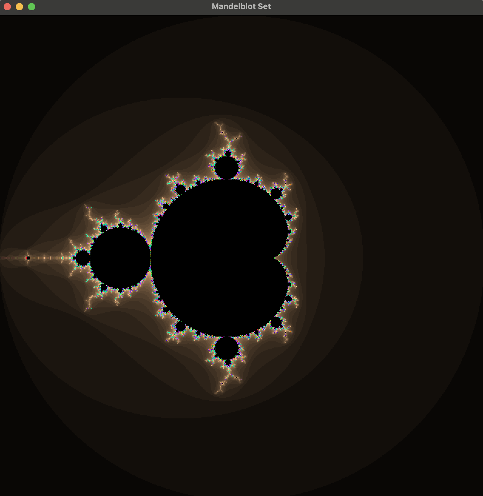
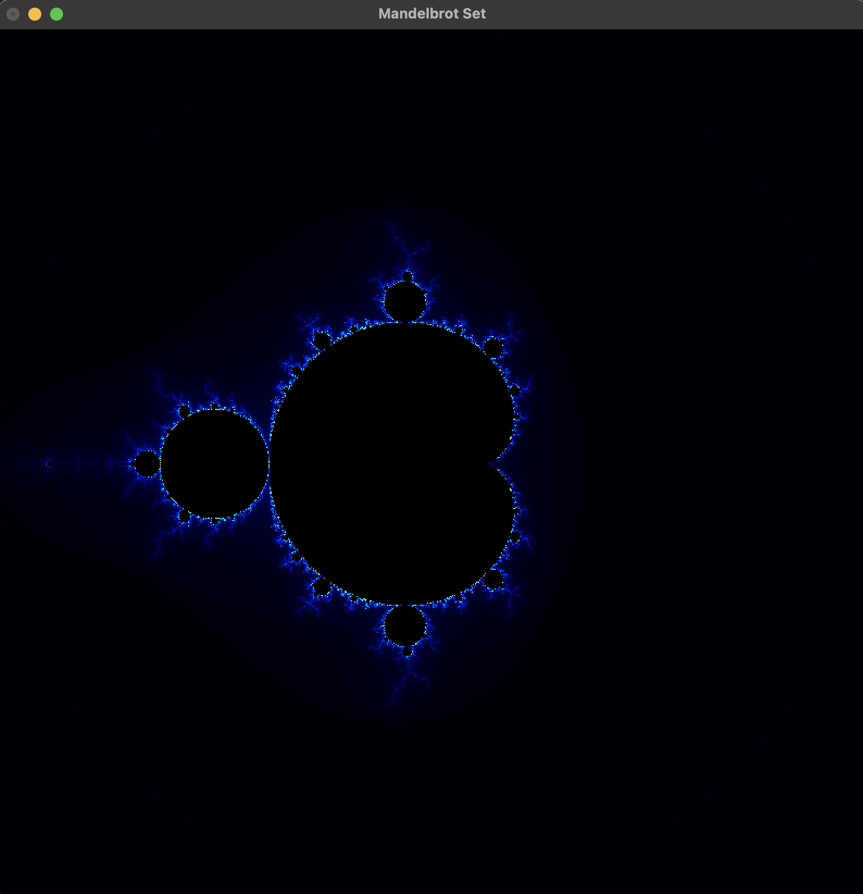

## マンデルブロ集合
このプロジェクトではマンデルブロ集合について触れてみた。

### MandelbrotSetProgram
マンデルブロ集合を見つけるプログラムをC++コードを記述した。
- ex1.cpp
    - ここではC++の<complex>ライブラリを使わずに実装した
- ex2.cpp
    - ここではC++の<complex>ライブラリを使用して実装した

### MandelbrotSetSfml
C++のクロスプラットフォームなマルチメディアライブラリである**SFML**(Simple and Fast Multimedia Library)を使用して視覚化を行った。
開発環境はxcode

### MandelbrotSetOpenGL
オープンソースなコンピュータグラフィックスライブラリである**OpenGL**(Open Graphics Library)を使用して視覚化を行った。
開発環境はxcode

